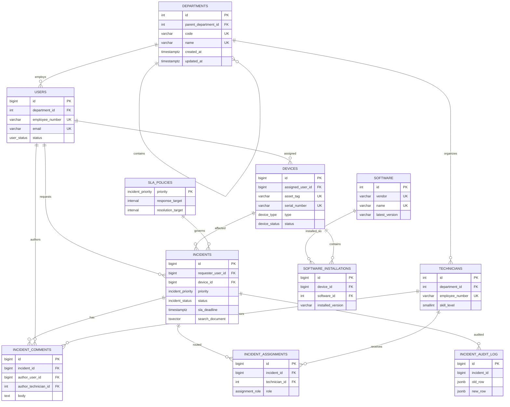

# SQL Support Lab

[](https://github.com/German4341374/sql-support-lab/actions/workflows/ci.yml)
[](docker-compose.yml)
[](LICENSE)

A PostgreSQL lab with a Service Desk dataset: users, devices, tickets, and installed software.
Load the sample data, pick a query, and inspect the result or its query plan.

The exercises cover joins, window functions, indexes, transactions, and triggers.
It's SQL and a few Bash scripts, with no app or web interface to set up.

## Highlights

- nine required domain tables plus SLA policy and audit tables;
- primary, foreign, unique, and check constraints;
- PostgreSQL enums and an interval-based SLA lookup table;
- deterministic seed with 20,000 incidents and no `random()` calls;
- 35 standalone query scenarios from operational reports to window functions;
- materialized aggregation, safe upsert, audit triggers, and full-text search;
- five measured before/after `EXPLAIN ANALYZE` experiments;
- Docker Compose workflow for Linux and Windows with WSL2;
- a destructive, isolated smoke test that rebuilds and validates the database;
- minimal-permission GitHub Actions validation.

## Dataset

| Entity | Deterministic rows |
| --- | ---: |
| Departments | 20 |
| Users | 500 |
| Devices | 1,000 |
| Technicians | 100 |
| Software products | 50 |
| Software installations | 6,000 |
| Incidents | 20,000 |
| Incident comments | 40,000 |
| Incident assignments | 22,857 |

All timestamps, relationships, statuses, problem text, installed versions, and
identifiers are derived from `generate_series` and fixed expressions. Rebuilding
the same PostgreSQL version produces the same logical dataset.

## ER diagram



`incident_audit_log.incident_id` intentionally has no foreign key. Audit evidence
must remain valid after an incident is deleted.

## Prerequisites

- Docker Engine with Docker Compose v2;
- Bash;
- GNU Make is optional;
- Linux or Windows with WSL2.

The project requires no cloud account or paid service. The Compose credentials
are development-only defaults for a local disposable database.

## Quick start

Copy the optional environment example:

```bash
cp .env.example .env
```

Start PostgreSQL and load the complete optimized lab:

```bash
docker compose up --detach db
bash scripts/init.sh
```

Connect with `psql` inside the container:

```bash
docker compose exec db psql --username support_lab --dbname support_lab
```

Run a scenario:

```bash
docker compose exec -T db \
  psql --username support_lab --dbname support_lab \
  < queries/basic/02_overdue_sla.sql
```

Stop the database:

```bash
docker compose down
```

Remove the database volume:

```bash
docker compose down --volumes
```

## Automated verification

The smoke test destroys only this Compose project's database volume, starts
PostgreSQL, loads migrations and seed data, applies optimized indexes, and
asserts row counts, key query results, the materialized view, full-text index,
and audit trigger:

```bash
bash scripts/smoke-test.sh
```

Capture all five before/after plans:

```bash
bash scripts/capture-plans.sh
```

Common Make targets:

```bash
make up
make init
make test
make smoke
make plans
make clean
```

## Repository structure

```text
migrations/                  Schema, database functions, views, optimized indexes
seed/                        Deterministic large dataset
queries/basic/               Operational support queries
queries/advanced/            Analytics and PostgreSQL-specific scenarios
optimization/scenarios/      Five EXPLAIN ANALYZE statements
optimization/results/        Committed before/after plan evidence
tests/                       Database smoke assertions
scripts/                     Bash orchestration only
docs/                        Model, indexing, testing, and query explanations
```

## SQL scenarios

| # | Scenario | Main concept |
| ---: | --- | --- |
| 01 | Open Critical incidents | Partial-index-shaped operational queue |
| 02 | Overdue SLA | Interval arithmetic and stable reporting cutoff |
| 03 | Average resolution by priority | Conditional population and duration aggregation |
| 04 | Technician workload | Active assignments and grouped joins |
| 05 | Repeated device problems | Multi-column grouping and `HAVING` |
| 06 | Frequent requesters | Cross-domain aggregation and filtered count |
| 07 | Top software installations | Product and device adoption |
| 08 | Devices with outdated software | Version mismatch join |
| 09 | Monthly trend | Time bucketing and filtered aggregate |
| 10 | First response time | Timestamp duration statistics |
| 11 | Inventory by department | Asset ownership and warranty status |
| 12 | Status/priority matrix | Aggregate `FILTER` clauses |
| 13 | Comment activity | Child-row aggregation |
| 14 | SLA compliance | Percentage with `NULLIF` |
| 15 | Unassigned active incidents | Correlated anti-join |
| 16 | Seven-day rolling average | Window frame |
| 17 | Department tree | Recursive CTE and path accumulation |
| 18 | Technician ranking | `dense_rank` partition |
| 19 | Resolution percentiles | Ordered-set aggregates |
| 20 | Monthly metrics | Materialized view |
| 21 | Assignment transaction | Locks, atomic writes, rollback |
| 22 | Software catalog upsert | `ON CONFLICT DO UPDATE` |
| 23 | Audit trigger | JSONB old/new row evidence |
| 24 | Active Critical lookup | Partial index |
| 25 | Incident search | Generated `tsvector`, web query, GIN |
| 26 | Repeat requester cohorts | `lag` and interval classification |
| 27 | Device incident gaps | Per-device window function |
| 28 | Department SLA breach | Multi-level business aggregation |
| 29 | Version distribution | Grouping across installation state |
| 30 | Hourly workload heatmap | Date-part grouping |
| 31 | Service reliability | Multiple filtered measures |
| 32 | Latest incident per device | `LATERAL` join |
| 33 | Department dashboard | JSONB construction |
| 34 | Devices without recent incidents | `NOT EXISTS` anti-join |
| 35 | Zero-filled month series | `generate_series` and outer join |

Every statement is available as an individual file under `queries/`.
[docs/query-guide.md](docs/query-guide.md) explains how to approach and modify
the scenarios.

## Optimization results

The five comparisons cover:

1. active Critical incident queue;
2. ordered active SLA queue;
3. current technician workload;
4. device-specific problem history;
5. incident full-text search.

The optimized indexes are deliberately isolated in
`migrations/003_optimization_indexes.sql`, so the capture script can measure
the same queries before and after. See
[optimization/README.md](optimization/README.md) for the expected planner
changes and [docs/optimization-results.md](docs/optimization-results.md) for the
measured summary.

Raw plans are committed in [optimization/results](optimization/results).

Measured on the pinned CI container, execution time changed from 2.331 to
0.487 ms for the Critical queue, 6.762 to 0.551 ms for the SLA queue, 2.388 to
0.594 ms for a technician queue, 5.232 to 2.291 ms for recurring device
problems, and 8.108 to 3.472 ms for full-text search. These are run-specific
measurements; the raw plan nodes and buffer evidence are the durable result.

## Example output

Initialization prints deterministic counts:

```text
departments=20
users=500
devices=1000
technicians=100
incidents=20000
comments=40000
installations=6000
```

The smoke test finishes with:

```text
       result        | incident_count | comment_count
---------------------+----------------+---------------
 smoke-test-passed   |          20000 |         40000
```

Plan output contains the executed node tree, actual rows, buffer usage, and
planning/execution time:

```text
Planning Time: ...
Execution Time: ...
```

## Important design decisions

- Enum types constrain small stable state sets; `sla_policies` remains a table
  because business targets are data and may change.
- `timestamptz` is used for operational events; reporting is explicitly UTC.
- Foreign-key columns receive indexes when they are common join paths.
- Specialized indexes are partial or covering to reduce write/storage cost.
- Full-text content is a stored generated column so query and index expressions
  cannot drift.
- Audit rows retain JSONB snapshots even if their source incident is deleted.
- Optimization evidence uses `ANALYZE` and buffer counts, not execution time
  alone.

## Troubleshooting

### Port 54329 is already in use

Set another local port in `.env`:

```text
POSTGRES_PORT=54330
```

### Schema objects already exist

`scripts/init.sh` intentionally resets the `public` schema. Confirm that the
Compose connection targets the disposable `support_lab` database before running
it.

### Plans differ between runs

Cache state, CPU, filesystem, and PostgreSQL patches affect timing and sometimes
plan selection. Compare scan type, indexes, row filtering, and buffers first.

### WSL2 cannot reach Docker

Enable WSL integration in Docker Desktop and run the commands from the Linux
distribution, not Windows PowerShell.

## Further reading

- [Data model](docs/data-model.md)
- [Indexing strategy](docs/indexing.md)
- [Query guide](docs/query-guide.md)
- [Testing workflow](docs/testing.md)
- [Contributing](CONTRIBUTING.md)
- [Security policy](SECURITY.md)

## License

Licensed under the [MIT License](LICENSE).
